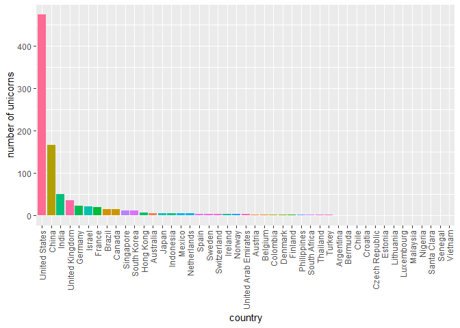
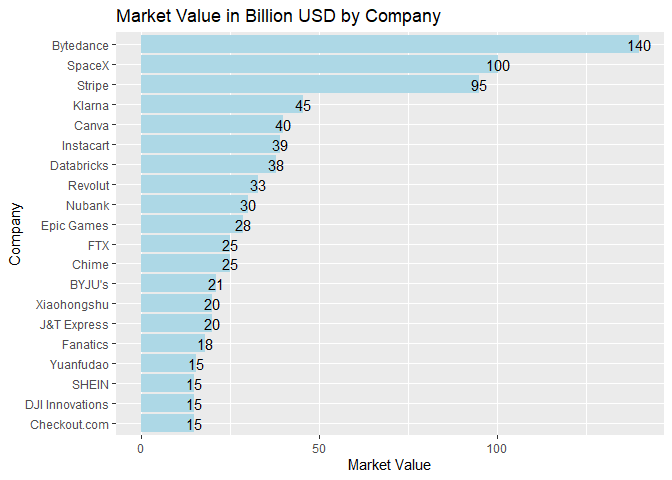
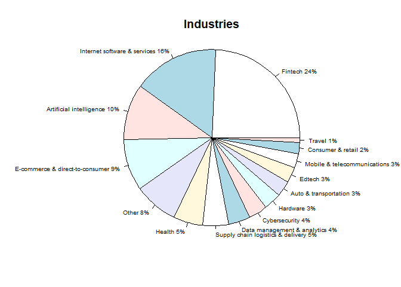
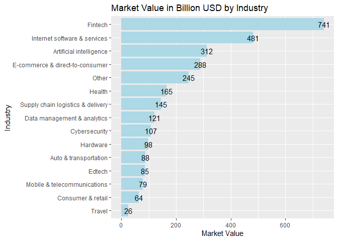

Unicorns
================
Patick Bensch
1/4/2022

Source: Unicorn-startups-dataset, cleaned, Author: Niek van der Zwaag,
based on a dataset shared by @ramjasmaurya,
<https://www.kaggle.com/niekvanderzwaag/unicorn-startups-cleaned>

This is a short analysis of the unicorns dataset in R.The dataset
contains data on privately held startups that are valued at minimum of 1
billion USD. The dataset is from 2021 and not completely up to date, as
at least one company of that list has since gone public.

Questions:

1.  Which countries have the most unicorns?
2.  What are the unicorns with the highest market values?
3.  In what industries do these unicorns operate?

Since the data is already cleaned by the creator of the dataset I go
right into the analysis.

## Load Libraries

``` r
library(tidyverse)
```

    ## -- Attaching packages --------------------------------------- tidyverse 1.3.1 --

    ## v ggplot2 3.3.5     v purrr   0.3.4
    ## v tibble  3.1.6     v dplyr   1.0.8
    ## v tidyr   1.2.0     v stringr 1.4.0
    ## v readr   2.1.2     v forcats 0.5.1

    ## -- Conflicts ------------------------------------------ tidyverse_conflicts() --
    ## x dplyr::filter() masks stats::filter()
    ## x dplyr::lag()    masks stats::lag()

``` r
library(dplyr)
library(janitor)
```

    ## 
    ## Attache Paket: 'janitor'

    ## Die folgenden Objekte sind maskiert von 'package:stats':
    ## 
    ##     chisq.test, fisher.test

``` r
library(ggplot2)
library(forcats)
```

## Read the data

I drop na values from the dataset.

    ## 'data.frame':    927 obs. of  11 variables:
    ##  $ X          : chr  "0" "1" "2" "3" ...
    ##  $ Company    : chr  "Bytedance" "SpaceX" "Stripe" "Klarna" ...
    ##  $ Valuation  : num  140 100.3 95 45.6 40 ...
    ##  $ Date.Joined: chr  "4/7/2017" "12/1/2012" "1/23/2014" "12/12/2011" ...
    ##  $ Country    : chr  "China" "United States" "United States" "Sweden" ...
    ##  $ City       : chr  "Beijing" "Hawthorne" "San Francisco" "Stockholm" ...
    ##  $ Industry   : chr  "Artificial intelligence" "Other" "Fintech" "Fintech" ...
    ##  $ Investor.1 : chr  "Sequoia Capital China" "Founders Fund" "Khosla Ventures" "Institutional Venture Partners" ...
    ##  $ Investor.2 : chr  "SIG Asia Investments" "Draper Fisher Jurvetson" "LowercaseCapital" "Sequoia Capital" ...
    ##  $ Investor.3 : chr  "Sina Weibo" "Rothenberg Ventures" "capitalG" "General Atlantic" ...
    ##  $ Investor.4 : chr  "Softbank Group" "" "" "" ...

## What countries have the most unicorns?

Look at the list of countries in the dataset:

    ##                 Country
    ## 1                 China
    ## 2         United States
    ## 3                Sweden
    ## 4             Australia
    ## 5        United Kingdom
    ## 6                Brazil
    ## 7             Hong Kong
    ## 8                 India
    ## 9             Indonesia
    ## 10              Germany
    ## 11               Mexico
    ## 12               Canada
    ## 13               Turkey
    ## 14          South Korea
    ## 15          Netherlands
    ## 16               Israel
    ## 17             Colombia
    ## 18              Belgium
    ## 19            Lithuania
    ## 20              Estonia
    ## 21               France
    ## 22              Austria
    ## 23              Ireland
    ## 24            Singapore
    ## 25              Vietnam
    ## 26 United Arab Emirates
    ## 27          Switzerland
    ## 28            Argentina
    ## 29                Spain
    ## 30                Japan
    ## 31           Luxembourg
    ## 32              Nigeria
    ## 33          Santa Clara
    ## 34              Finland
    ## 35          Philippines
    ## 36              Denmark
    ## 37              Senegal
    ## 38              Bermuda
    ## 39               Norway
    ## 40         South Africa
    ## 41                Chile
    ## 42             Thailand
    ## 43             Malaysia
    ## 44       Czech Republic
    ## 45              Croatia

</br > There are in total 45 Countries in the dataset.

</br > </br >

Next I plot the number of unicorns per country:

<!-- -->

</br >

As can be seen in the chart, the USA has by far the most unicorns,
followed by China and India. Of all 45 countries, only 11 have more than
10 unicorn, as can be seen in the following table:

    ##           Group.1   x
    ## 1   United States 473
    ## 2           China 167
    ## 3           India  50
    ## 4  United Kingdom  36
    ## 5         Germany  23
    ## 6          Israel  21
    ## 7          France  19
    ## 8          Brazil  15
    ## 9          Canada  15
    ## 10      Singapore  11
    ## 11    South Korea  11
    ## 12      Hong Kong   7
    ## 13      Australia   6
    ## 14          Japan   6
    ## 15      Indonesia   5
    ## 16         Mexico   5
    ## 17    Netherlands   5
    ## 18          Spain   4
    ## 19         Sweden   4
    ## 20    Switzerland   4

</br >

Interestingly, out of these 11 countries 4 are in Asia, and of the top
15 countries 7 are asian countries, perhaps a reflection of the
increasing economic importance of the continent.

</br >

## Market Values

The total market value of all unicorns is 3050.93 billion USD. Since
there are overall 927 companies with market values in the dataset, the
average value of a unicorn is around 3 billion USD. </br >

Next I want to see a visualization of the largest unicorns, a horizontal
bar chart would be suitable for that.

I set the cutoff at 20 to keep the chart neat.

</br >

<!-- -->

Next, I want to see what industries hold the highest market values. For
that, I create a pie chart to visualize the percentages.

<!-- -->

It can be seen that fintech accounts for the largest share in terms of
market value. Next I look at the absolute values with a horizontal bar
chart:

<!-- -->

Overall more than 50 percent of all market value in the dataset is
concentrated in technology related industries.
